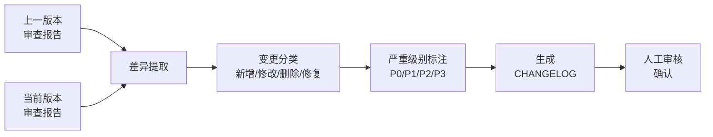

# 变更日志工作流 (CHANGELOG Workflow)

## 概述

变更日志（CHANGELOG）自动生成工作流，用于从两次论文审查报告之间提取变更摘要，生成结构化的版本变更记录。该工作流确保每次版本迭代的修改内容有据可查、可追溯、可审计。

## 自动生成流程



## 变更分类模板

### 1. 新增 (Added)
版本中新增的内容，包括但不限于：
- 新增章节或小节
- 新增图表、表格
- 新增数据源或实验
- 新增参考文献
- 新增论证线索

### 2. 修改 (Changed)
对已有内容的实质性修改：
- 章节结构调整
- 论证逻辑重排
- 数据更新或修正
- 措辞优化（涉及语义变更）
- 图表替换或更新

### 3. 删除 (Removed)
有意移除的内容：
- 删除冗余章节
- 移除无效数据
- 删除不适用的引用
- 移除逻辑断裂的论证段落

### 4. 修复 (Fixed)
问题修复，通常与审查报告中指出的缺陷对应：
- 修复引用格式错误
- 修复图表编号错误
- 修复数据不一致
- 修复逻辑跳跃
- 修复措辞歧义

## 严重级别标注

| 级别 | 定义 | 响应要求 |
|------|------|----------|
| **P0** | 致命问题：数据错误、论证断裂、引用缺失导致结论不成立 | 必须立即修复，修复后当前版本方可视为有效 |
| **P1** | 严重问题：章节结构不合理、关键论证薄弱、重要数据缺失 | 应在下一版本优先修复 |
| **P2** | 一般问题：表述不够精确、图表不够清晰、引用不够充分 | 计划修复，不影响核心论证 |
| **P3** | 轻微问题：格式瑕疵、措辞可优化、排版微调 | 择机修复，不影响论文质量评估 |

## 从审查报告提取变更的方法

1. **获取相邻版本审查报告**：确保两个版本的审查格式一致
2. **逐章节对比**：按章节逐一对比审查意见的变化
3. **识别新增问题**：当前版本审查中首次出现的问题 → 需追溯是否由本次修改引入
4. **识别已修复问题**：上一版本审查中提到、当前版本审查中消失的问题 → 已修复
5. **识别残留问题**：两版审查中均存在的问题 → 未修复或修复不彻底
6. **识别改进项**：当前版本审查中指出的新改进 → 新优化点

## CHANGELOG 模板

```markdown
# CHANGELOG

## [版本号] (YYYY-MM-DD)

### 概述
简要描述本轮修改的整体目标和核心变更。

### P0 修复
- [问题描述] → [修复措施]

### P1 修复
- [问题描述] → [修复措施]

### 新增
- [新增内容描述]

### 修改
- [修改内容描述]

### 删除
- [删除内容描述及原因]

### 已知待处理
| 级别 | 问题描述 | 计划处理版本 |
|------|----------|-------------|
| P1 | [问题] | vX.X |
| P2 | [问题] | vX.X |

### 质量评分变化
| 维度 | 修改前 | 修改后 | 变化 |
|------|--------|--------|------|
| 内容完整性 | XX | XX | +X |
| 逻辑完整性 | XX | XX | +X |
| 逻辑闭环 | XX | XX | +X |
| AI检测评估 | XX | XX | +X |
| **综合得分** | **XX.XX** | **XX.XX** | **+X.XX** |
```

## 示例 CHANGELOG 条目

以下为完全虚构的示例条目，用于展示 CHANGELOG 格式：

````markdown
# CHANGELOG

## v2.1 (2025-03-15)

### 概述
本轮主要补充实验验证章节，修复插图引用问题，强化论证逻辑闭环。

### P0 修复
- 修复插图引用缺失（图3全文零引用→新增3处引用标注）
- 修复数据表与正文数据不一致（表2第3列数值与正文描述不匹配）

### P1 修复
- 修复方法论章节的步骤描述跳跃（补充步骤2与步骤3之间的过渡逻辑）
- 修复参考文献格式不一致（3处作者名缩写格式统一为全称）

### 新增
- 新增第5章实验验证章节（含3组对比实验）
- 新增实验数据附录A（原始实验记录表）

### 修改
- 调整第3章论证结构：先分析再归因
- 优化第2章文献综述分类框架（按方法论分类→按问题域分类）

### 删除
- 删除第4章中与核心论证无关的延伸讨论段落（约500字）

### 已知待处理
| 级别 | 问题描述 | 计划处理版本 |
|------|----------|-------------|
| P2 | 部分图表分辨率偏低 | v2.2 |
| P3 | 多处"本文"可替换为更精确的主语 | v3.0 |

### 质量评分变化
| 维度 | 修改前(v2.0) | 修改后(v2.1) | 变化 |
|------|-------------|-------------|------|
| 内容完整性 | 78 | 85 | +7 |
| 逻辑完整性 | 72 | 80 | +8 |
| 逻辑闭环 | 70 | 78 | +8 |
| AI检测评估 | 68 | 75 | +7 |
| **综合得分** | **72.10** | **79.65** | **+7.55** |
````

## 不适用 CHANGELOG 的场景

以下修改类型不适合放入 CHANGELOG：
- 仅修改错别字、标点符号的纯校对性修改
- 仅调整排版格式的纯格式化修改
- 不改变语义的措辞微调
- 临时性标注（如"此处待确认"→删除标注）

这类微小修改可汇总为一句话描述："常规校对与格式微调"，无需逐条记录。

## 使用建议

1. **每次版本发布时生成 CHANGELOG**：不事后补录
2. **P0 修复必须有对应审查记录**：防止"口头修复"无据可查
3. **CHANGELOG 本身也是版本的一部分**：随论文版本一同保存
4. **定期回溯 CHANGELOG**：确认残留学问题是否在下个版本中如期处理
