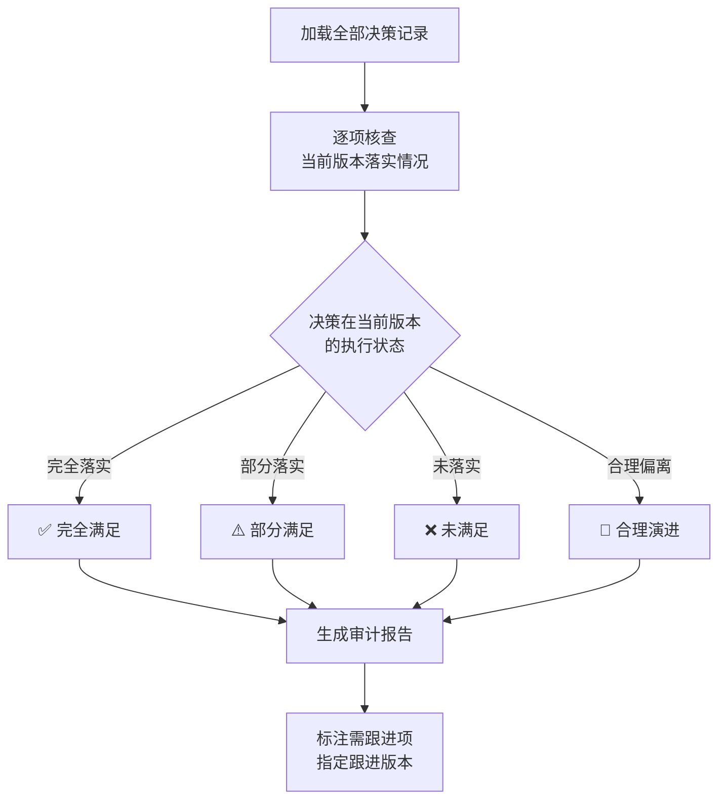

# 决策日志与审计 (Decision Log & Audit)

## 概述

论文写作过程中会产生大量关键决策——章节结构如何设计、论证框架如何搭建、数据如何呈现等。决策日志用于结构化记录这些决策，并通过逐版审计追踪落实状态，确保每个决策不丢失、不遗漏。

## 决策日志模板

每项决策按以下结构记录：

```markdown
### 决策 #[编号]

| 字段 | 内容 |
|------|------|
| **决策编号** | D-[YYYY]-[序号]（如 D-2025-001） |
| **决策日期** | YYYY-MM-DD |
| **决策人角色** | 实际撰写者 / 署名作者 / 外部评审 / 导师 |
| **决策类型** | 架构 / 内容 / 方法 / 格式 / 数据 / 论证 |
| **决策背景** | 触发该决策的具体场景或问题 |
| **决策内容** | 明确描述做出的选择（要具体到可验证） |
| **备选方案** | 曾考虑过的其他方案及放弃原因 |
| **影响范围** | 受影响的章节/图表/论证 |
| **执行状态** | 待执行 / 执行中 / 已完成 / 已废弃 |
| **关联决策** | 与之相关的其他决策编号 |
```

## 决策类型分类

| 类型 | 说明 | 示例关键词 |
|------|------|-----------|
| **架构** | 章节结构、论证框架的设计决策 | 章节划分、框架选择 |
| **内容** | 论文内容的增减或方向调整 | 增加/删除章节、内容范围界定 |
| **方法** | 研究方法、实验设计的选择 | 实验设计、数据采集方案 |
| **格式** | 引用格式、排版规范的确定 | 引用风格、图表编号规则 |
| **数据** | 数据呈现方式的选择 | 图表 vs 表格、数据聚合方式 |
| **论证** | 论证策略的调整 | 论证顺序、侧重点调整 |

## 示例决策记录

以下所有示例均为完全抽象化的虚构内容：

```markdown
### 决策 #1

| 字段 | 内容 |
|------|------|
| **决策编号** | D-2025-001 |
| **决策日期** | 2025-01-15 |
| **决策人角色** | 实际撰写者 |
| **决策类型** | 架构 |
| **决策背景** | 初稿章节划分过于分散，读者反馈逻辑流不清晰 |
| **决策内容** | 采用三层架构（表示层-业务层-数据层）组织论文核心章节 |
| **备选方案** | 方案A：按功能模块划分（放弃：模块间耦合度高，难以独立论证）；方案B：按时序流程划分（放弃：技术实现不是线性流程） |
| **影响范围** | 第3、4、5章的整体结构 |
| **执行状态** | 已完成（v2.0） |
| **关联决策** | D-2025-003 |

---

### 决策 #2

| 字段 | 内容 |
|------|------|
| **决策编号** | D-2025-002 |
| **决策日期** | 2025-02-20 |
| **决策人角色** | 外部评审 |
| **决策类型** | 内容 |
| **决策背景** | 外部评审反馈：缺少实验验证章节，理论说服力不足 |
| **决策内容** | 将实验结果独立为第5章，对照组设置在2组以上 |
| **备选方案** | 方案A：将实验嵌入第4章各小节（放弃：实验内容较多，嵌入会导致章节臃肿） |
| **影响范围** | 新增第5章，第4章结构调整 |
| **执行状态** | 已完成（v2.1） |
| **关联决策** | D-2025-001 |

---

### 决策 #3

| 字段 | 内容 |
|------|------|
| **决策编号** | D-2025-003 |
| **决策日期** | 2025-03-10 |
| **决策人角色** | 实际撰写者 |
| **决策类型** | 论证 |
| **决策背景** | AI检测评估多次指出技术描述段落有模板化表达 |
| **决策内容** | 模块描述采用概括性语言，技术细节移至附录 |
| **备选方案** | 方案A：全文重写技术描述段（放弃：工作量过大，且技术细节不影响核心论证） |
| **影响范围** | 第3-5章技术描述段落 |
| **执行状态** | 执行中（v3.0 部分完成） |
| **关联决策** | D-2025-001 |

---

### 决策 #4

| 字段 | 内容 |
|------|------|
| **决策编号** | D-2025-004 |
| **决策日期** | 2025-04-05 |
| **决策人角色** | 署名作者 |
| **决策类型** | 格式 |
| **决策背景** | 目标期刊要求 GB/T 7714 引用格式 |
| **决策内容** | 全文引用格式统一为 GB/T 7714-2015 标准 |
| **备选方案** | 无（期刊硬性要求） |
| **影响范围** | 全文参考文献列表及所有正文引用标注 |
| **执行状态** | 已完成（v3.1） |
| **关联决策** | 无 |
```

## 审计方法

决策审计用于核查所有决策在当前版本中的落实情况。

### 审计流程



### 审计分类标准

| 分类 | 符号 | 判定标准 |
|------|------|----------|
| **完全满足** | ✅ | 决策内容在当前版本中完整实现，无需后续处理 |
| **部分满足** | ⚠️ | 部分实现，仍有遗留工作，需在后续版本中完成 |
| **未满足** | ❌ | 完全未实现，可能是遗漏或执行中遇到障碍 |
| **合理演进** | 🔄 | 原决策因情况变化已不再适用，当前版本采用更优方案 |

### 审计报告模板

```markdown
# 决策审计报告

**审计版本**: vX.X
**审计日期**: YYYY-MM-DD
**决策总数**: N 项

## 审计摘要

| 分类 | 数量 | 占比 |
|------|------|------|
| ✅ 完全满足 | X | XX% |
| ⚠️ 部分满足 | X | XX% |
| ❌ 未满足 | X | XX% |
| 🔄 合理演进 | X | XX% |

## 逐项审计

### ✅ 完全满足

| 决策编号 | 决策摘要 | 落实证据 |
|----------|----------|----------|
| D-2025-001 | 采用三层架构组织核心章节 | 第3-5章已按表示层-业务层-数据层划分 |
| D-2025-002 | 将实验独立为第5章 | 第5章已完整呈现3组对比实验 |

### ⚠️ 部分满足

| 决策编号 | 决策摘要 | 已落实 | 未落实 | 跟进版本 |
|----------|----------|--------|--------|----------|
| D-2025-003 | 模块描述采用概括性语言 | 第3-4章已完成 | 第5章仍含技术细节 | v3.1 |

### ❌ 未满足

| 决策编号 | 决策摘要 | 原因 | 跟进计划 |
|----------|----------|------|----------|
| D-2025-005 | 外部评审反馈追踪 #3 | 等待外部评审反馈 | v4.0 前完成 |

### 🔄 合理演进

| 决策编号 | 原决策 | 当前做法 | 演变原因 |
|----------|--------|----------|----------|
| D-2025-004 | GB/T 7714 引用格式 | 改用目标期刊自定格式 | 投稿期刊变更 |
```

## 使用建议

1. **决策发生时立即记录**：不依赖事后回忆
2. **标注决策来源**：区分"自行判断"与"外部反馈"，便于后续追溯
3. **每个主要版本发布时审计**：确保关键决策不遗漏
4. **长期未执行的决策应主动评估**：标记为"合理演进"或制定明确计划
5. **废弃决策保留记录**：标注废弃原因，不删除原始记录
