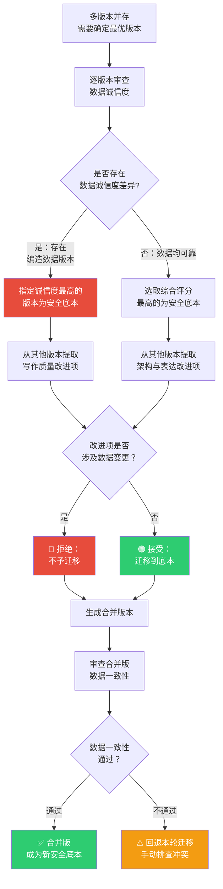

# 安全底本策略 (Safe Baseline Strategy)

## 核心目标

在多版本并行修改、多人协作或大量重构的场景中，确保始终存在一个"数据诚信度最高"的安全底本，防止因修改过程中的错误引入而导致论文数据质量的不可逆退化。

## 核心原则

### 原则 1：选定安全底本

以数据诚信度最高、无编造数据的版本为底本。安全底本的选择标准按优先级排序：

1. 数据来源可验证
2. 实验/调查数据真实可信
3. 引用完整且准确
4. 无占位符或编造内容
5. 论证结论与数据一致

> **判定方法**：逐章审查数据来源、核对引用、确认无"待补充"占位符。得分最高的版本即为安全底本。

### 原则 2：迁移改进项

从其他版本中迁移写作质量、架构组织、论证丰富度等方面的改进：
- 更好的章节结构或论述逻辑
- 更精炼的学术表达
- 更清晰的图表呈现
- 更完整的文献综述覆盖

### 原则 3：拒绝回退

其他版本中存在的以下内容**绝不**回退到底本：
- 编造或无法验证的数据
- 错误的引用或曲解的文献
- 占位符内容（"此处待补充"等）
- 与可验证事实矛盾的结论
- 为美化结果而修改的数据

### 原则 4：生成合并版

```
底本（数据安全）+ 迁移项（写作与结构改进）= 最优版本
```

## 优先级原则

```
数据诚信度 > 写作质量 > 架构美观度
```

| 优先级 | 维度 | 说明 |
|--------|------|------|
| 1（最高） | 数据诚信度 | 无编造数据、来源可追溯、引用准确 |
| 2 | 写作质量 | 学术表达规范、逻辑严密、语言精炼 |
| 3 | 架构美观度 | 章节结构清晰、图表美观、排版规范 |

**硬性规则**：不得以牺牲数据诚信度为代价换取写作质量或架构美观度的提升。

## 操作流程图



## 虚构示例场景

以下为完全虚构的场景，用于说明安全底本策略的应用：

### 场景：两位协作者并行修改同一论文

**背景**：
- 某软件系统论文已完成初稿（v2.0），综合评分约72-85分
- 作者A 基于 v2.0 修改实验数据与分析章节 → v2.1-A
- 作者B 基于 v2.0 重构文献综述与理论框架 → v2.1-B

### 审查发现：

| 版本 | 数据诚信度 | 写作质量 | 架构组织 | 综合评分 |
|------|-----------|----------|----------|----------|
| v2.0 (原版) | ✅ 高（数据可追溯） | 约72分 | 约70分 | 约72分 |
| v2.1-A | ⚠️ 中（部分数据来源不明） | 约75分 | 约72分 | 约74分 |
| v2.1-B | ✅ 高（仅重组结构） | 约80分 | 约85分 | 约82分 |

### 应用安全底本策略：

1. **选定底本**：v2.0（数据诚信度最高）—— v2.1-A 的数据诚信度下降，不能作为底本
2. **迁移改进项**：
   - 从 v2.1-A 迁移：写作风格优化（不涉及数据的表达改进）
   - 从 v2.1-B 迁移：文献综述重构、理论框架优化、章节结构调整
3. **拒绝回退**：v2.1-A 中来源不明的数据不迁移
4. **生成合并版 v2.2**：v2.0 的数据 + v2.1-A的写作优化 + v2.1-B的架构优化 = 综合评分约85分

### 关键教训：

- v2.1-A 虽然综合评分高于 v2.0，但因数据诚信度下降，不能被选为安全底本
- 写作质量提升不能以引入不可信数据为代价

## 最佳实践

1. **每次重大修改前明确当前底本**：标注哪个版本是当前的安全底本
2. **修改完成后重新评估数据诚信度**：确认无数据退化
3. **并行修改时明确分工边界**：避免不同分支对相同数据做矛盾修改
4. **合并时优先使用安全底本策略**：不简单取"最新版本"或"最高分版本"
5. **安全底本单独存档**：不参与日常修改，仅供回溯和合并使用
