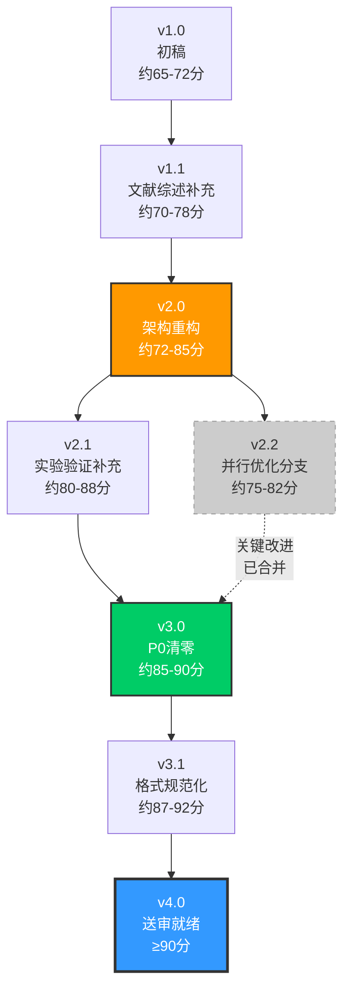
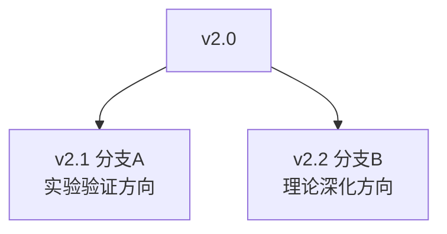
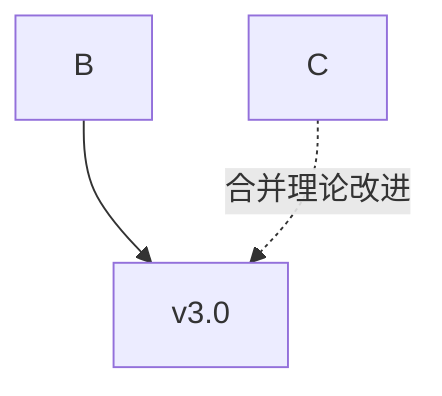
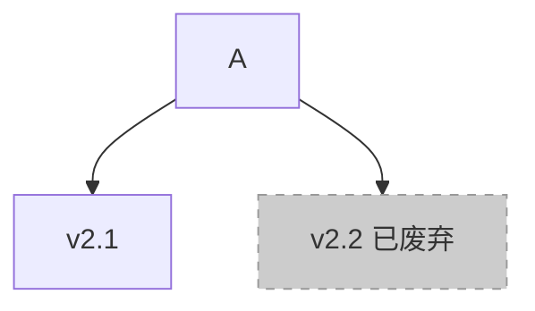

# 版本血缘树 (Version Lineage Tree)

## 概念

版本血缘树（Version Lineage Tree）用于可视化学术论文在写作过程中多个版本之间的继承、分支与合并关系。当论文经历多轮修改、多人协作或平行实验时，版本关系不再是简单的线性序列，而是一个有向无环图（DAG）。

## 核心概念

### 节点类型

| 节点类型 | 说明 | 标注颜色 |
|----------|------|----------|
| **普通版本** | 常规迭代修改后的版本 | 默认/蓝色 |
| **架构重构** | 章节结构或论证框架发生重大变更 | 🟠 橙色 |
| **P0清零** | 当前版本所有 P0 级问题已修复 | 🟢 绿色 |
| **送审就绪** | 达到送审质量标准（≥85分） | 🔵 深蓝/加粗 |
| **废弃分支** | 已放弃的并行修改分支 | ⚫ 灰色 |

### 分支类型

| 分支类型 | 说明 | 示例场景 |
|----------|------|----------|
| **线性演进** | 单一版本链，v1.0 → v1.1 → v2.0 | 单人顺序修改 |
| **并行分支** | 同时从某个版本分出多个修改方向 | 多人并行修改不同章节 |
| **合并节点** | 多个分支合并为一个版本 | 整合多位协作者的修改 |

## 节点标注方法

在 Mermaid 图中使用 `style` 指令标注关键节点：

```
style V_A fill:#ff9900,stroke:#333,stroke-width:2px  // 架构重构 - 橙色
style V_B fill:#00cc66,stroke:#333,stroke-width:2px  // P0清零 - 绿色
style V_C fill:#3399ff,stroke:#333,stroke-width:3px  // 送审就绪 - 深蓝加粗
style V_D fill:#cccccc,stroke:#999,stroke-dasharray: 5 5  // 废弃分支 - 灰色虚线
```

## Mermaid 代码示例

以下是一个完全虚构的论文版本演进场景（"某软件系统论文版本演进"），用于演示版本血缘树的绘制方法：



### 图中关键节点的解读

- **v1.0（初稿）**：论文框架初具，各章节内容初步填充，质量评分约65-72分
- **v1.1（文献综述补充）**：补充了系统性文献综述，评分提升至约70-78分
- **v2.0（架构重构）**：章节结构进行重大调整，论证逻辑重新编排，评分约72-85分
- **v2.1（实验验证补充）**：新增实验验证章节，数据与结论对齐，评分约80-88分
- **v2.2（并行优化分支）**：独立的写作风格优化分支，关键改进已合并入后续版本
- **v3.0（P0清零）**：所有P0级严重问题清零，评分约85-90分
- **v3.1（格式规范化）**：引用格式、图表编号、排版全面规范化，评分约87-92分
- **v4.0（送审就绪）**：达到送审质量标准，评分≥90分

## 分支与合并的表示方法

### 分支表示

当从版本 A 同时分出两个独立修改方向时：



### 合并表示

当一个版本吸收了多个分支的改进时，使用虚线箭头标注合并源：



### 废弃分支表示

使用灰色虚线表示已放弃的分支：



## 使用建议

1. **每次重大修改后更新血缘树**：添加新节点，标注节点类型
2. **废弃分支保留记录**：不删除废弃节点，用灰色标注并说明废弃原因
3. **合并节点附带说明**：标注合并了哪些分支的哪些改进
4. **定期审视整体演进**：确保演进路径符合论文写作目标
